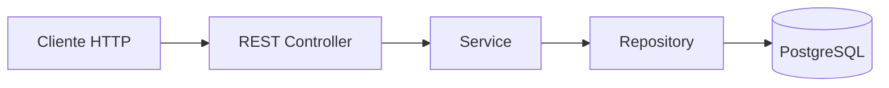

# SistemaVentasRutas


Sistema de gestión de ventas en ruta desarrollado con Spring Boot, PostgreSQL y Docker.

Su objetivo es permitir registrar ventas, administrar clientes y productos, controlar el stock y, en futuras etapas, sincronizar una aplicación Android offline con una API REST desplegada en Microsoft Azure

## Características principales

- 📦 Gestión de productos
- 👥 Gestión de clientes
- 🛣️ Gestión de rutas
- 💰 Registro de ventas
- 📉 Control automático de stock
- 🧪 Pruebas unitarias
- 🐳 Docker Compose
- 🗃️ Migraciones con Flyway


## Arquitectura


## Tecnologías

| Categoría | Tecnologías |
|-----------|-------------|
| Backend | Java 21, Spring Boot |
| Base de datos | PostgreSQL |
| Persistencia | Spring Data JPA |
| Migraciones | Flyway |
| Testing | JUnit 5, Mockito |
| Contenedores | Docker Compose |
| Control de versiones | Git y GitHub |

## Estado del proyecto

Actualmente el backend se encuentra operativo y las principales funcionalidades de negocio ya han sido implementadas. El proyecto continuará evolucionando con nuevos módulos, una aplicación Android y el despliegue en Microsoft Azure.
### Implementado

- Gestión de clientes
- Gestión de productos
- Gestión de rutas
- Registro de ventas
- Anulación de ventas
- Control de stock
- Pruebas unitarias

### En desarrollo

- Movimientos de stock
- Pagos parciales

## Roadmap

- [x] Gestión de clientes
- [x] Gestión de productos
- [x] Gestión de rutas
- [x] Registro de ventas
- [x] Pruebas unitarias
- [ ] Movimientos de stock
- [ ] Pagos parciales
- [ ] Aplicación Android
- [ ] Panel administrativo
- [ ] Despliegue en Azure


## Instalación

### Clonar el repositorio

```bash
git clone https://github.com/fixchaos/SistemaVentasRuta.git

cd SistemaVentasRuta
```

### Levantar PostgreSQL

```bash
docker compose up -d
```

### Ejecutar el backend

```bash
cd backend
./mvnw spring-boot:run
spring-boot:run
```

---

## Estructura del proyecto

```text
SistemaVentasRuta

backend/
 ├── src/
 ├── pom.xml
 └── mvnw

android/

docs/

compose.yaml

README.md
```

## Documentación

La documentación técnica del proyecto se encuentra en la carpeta **docs**.

- Análisis funcional
- Modelo de datos

# Objetivo del proyecto

Este proyecto busca servir como una plataforma de apoyo para vendedores en ruta, permitiendo trabajar incluso sin conexión a Internet y sincronizar la información posteriormente con un servidor central.

Al mismo tiempo, constituye un proyecto de aprendizaje y portafolio para profundizar en el desarrollo backend con Spring Boot, pruebas automatizadas, Docker y futuras tecnologías cloud como Microsoft Azure.