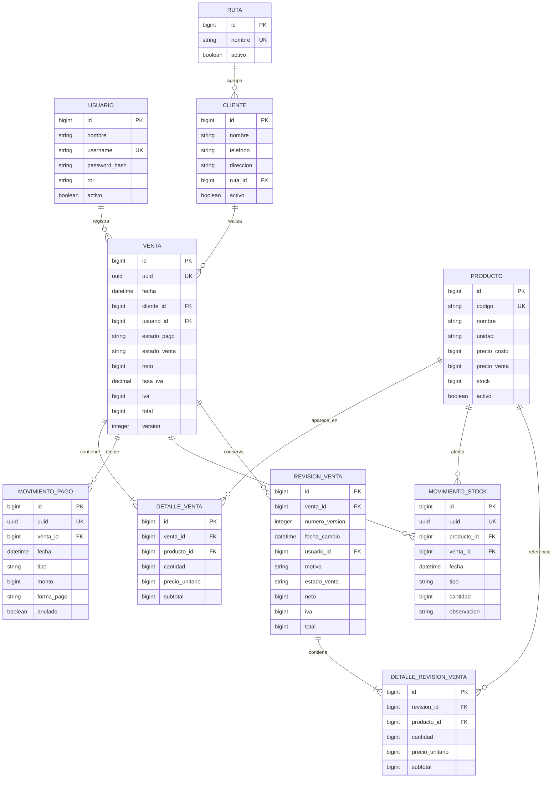

# Modelo de datos v1

## 1. Objetivo

Definir las tablas y relaciones principales antes de implementar las entidades de Spring Boot y Room.

## 2. Diagrama de relaciones

## 3. Explicacion de las relaciones

- Una ruta agrupa varios clientes, pero cada cliente pertenece como maximo a una ruta.
- Un cliente puede tener muchas ventas.
- Una venta contiene uno o mas detalles y cada detalle representa un producto vendido.
- Una venta puede tener varios movimientos de pago, incluidos abonos y devoluciones.
- Cada cambio de stock queda asociado al producto y, cuando corresponde, a la venta que lo origino.
- Antes de editar una venta se conserva una revision con sus importes y productos anteriores.

## 4. Decisiones de tipos de datos

### Dinero

Los montos en pesos chilenos se almacenan como enteros (`bigint`). Por ejemplo, `$12.990` se guarda como `12990`. No se utilizara `float` o `double`, porque pueden introducir errores de precision.

### Cantidades y stock

Todos los productos se venden en unidades completas. Las cantidades y el stock se almacenan como enteros (`bigint`) y deben ser mayores que cero cuando representan una venta o entrada.

### Datos del cliente

Nombre, telefono, direccion y ruta son obligatorios. Los datos bancarios o de transferencia no forman parte de la primera version y requeriran un diseno de seguridad antes de incorporarse.

### Identificadores

- `id` es la clave interna generada por PostgreSQL.
- `uuid` identifica operaciones creadas offline y permite reconocer reintentos sin duplicarlas.

### Version de venta

`version` aumenta con cada edicion. El PC o Android deben enviar la version que leyeron; si ya cambio en el servidor, la edicion se rechaza y se solicita actualizar los datos.

## 5. Valores controlados

- `rol`: `VENDEDOR`, `ADMINISTRADOR`.
- `estado_pago`: `PENDIENTE`, `PAGADO`.
- `estado_venta`: `CONFIRMADA`, `ANULADA`.
- `tipo` de movimiento de pago: `ABONO`, `DEVOLUCION`.
- `forma_pago`: `EFECTIVO`, `TRANSFERENCIA`.
- `tipo` de movimiento de stock: `VENTA`, `ANULACION`, `EDICION`, `ENTRADA`, `AJUSTE`.

En Java estos valores se representaran con `enum`, evitando textos distintos para un mismo concepto.

## 6. Calculos derivados

- `subtotal detalle = cantidad * precio_unitario`.
- `total venta = suma de subtotales`.
- `neto = total / (1 + tasa_iva)` con la regla de redondeo definida para CLP.
- `iva = total - neto`.
- `saldo pendiente = total - abonos validos + devoluciones validas` para ventas no anuladas.
- `stock actual = stock inicial + suma de movimientos de stock`.

Aunque algunos totales se pueden calcular, se guardan en la venta para conservar el valor historico y facilitar las consultas. El servicio de negocio sera responsable de calcularlos; no aceptara totales arbitrarios enviados por el telefono o el PC.

## 7. Reglas de integridad

1. `codigo` de producto, `username` y cada `uuid` deben ser unicos.
2. Una venta debe tener al menos un detalle.
3. Cantidad, precio y monto de abono deben ser mayores que cero.
4. Un detalle no puede repetir el mismo producto dentro de una venta; las cantidades se consolidan.
5. Una devolucion solo puede existir si hay pagos previos que devolver.
6. Una venta anulada no genera saldo pendiente.
7. La suma devuelta no puede superar la suma abonada.
8. Editar o anular una venta debe ejecutarse en una transaccion de base de datos.
9. Nombre, telefono, direccion y ruta del cliente son obligatorios.
10. Stock y cantidades deben ser numeros enteros.

## 8. Pendientes antes de implementar

- Confirmar la tasa inicial de IVA con una fuente oficial.
- Elegir la tecnologia del panel web para PC.
